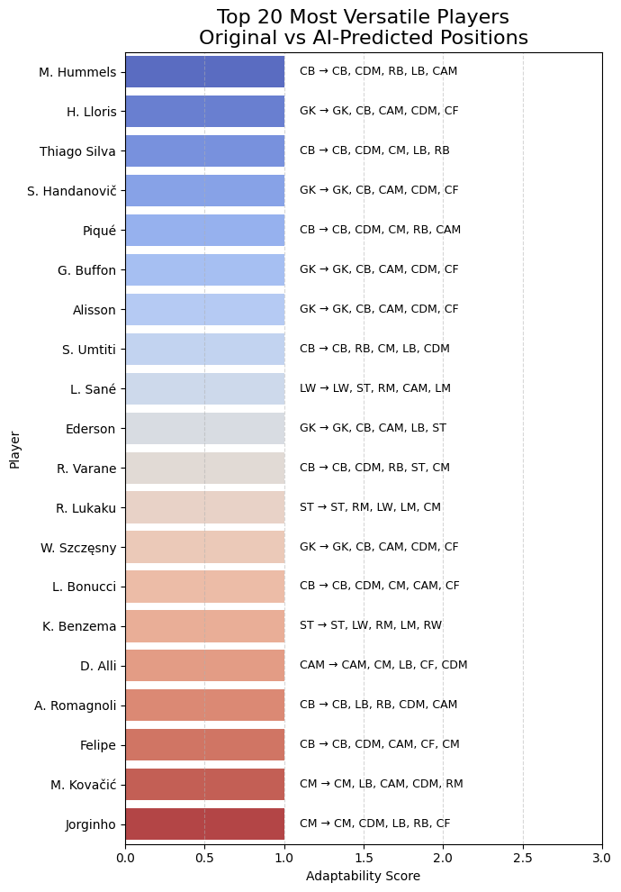

# VersaScout
# ⚽ VersaScout: AI-Based Player Versatility Assessment

This project uses machine learning to analyze and predict **positional flexibility** of FIFA players based on in-game attributes.

With over 17,000 players from SoFIFA, our AI model evaluates each player's ability to perform in roles beyond their assigned position — uncovering **hidden tactical assets** like F. Valverde or J. Kimmich who fit multiple positions effectively.

---

## 🔍 Key Features

- 🎯 **Original vs AI-Predicted Positions** for every player
- 📈 **Adaptability Score** — how many positions the player can fit into with high confidence
- 📊 **Interactive Visualization** of top 20 most versatile players
- 🧠 Supervised model trained using Random Forests on skill attributes only
- 🔍 Optional PCA + KMeans clustering for playstyle analysis

---

## 📷 Screenshots

### Top 20 Most Versatile Players (Matplotlib)



### Interactive Plot (Plotly)


---

## 🚀 Run the Project in Colab

1. Open the Colab notebook: [📎 Colab Notebook Link](#)
2. Upload your FIFA dataset CSV (from SoFIFA)
3. Run the cells to:
   - Clean & preprocess
   - Train model
   - Predict positional adaptability
   - Visualize results (Matplotlib & Plotly)

---

## 📁 Project Structure

```bash
.
├── README.md
├── AdaptiveXI.ipynb              # Main Google Colab notebook
├── images/
│   ├── top20_versatile_players.png
│   └── interactive_plot.png
├── data/
│   └── fifa_players.csv          # Your dataset (not uploaded here)
├── outputs/
│   └── comparison_table.csv      # Final player summary table
