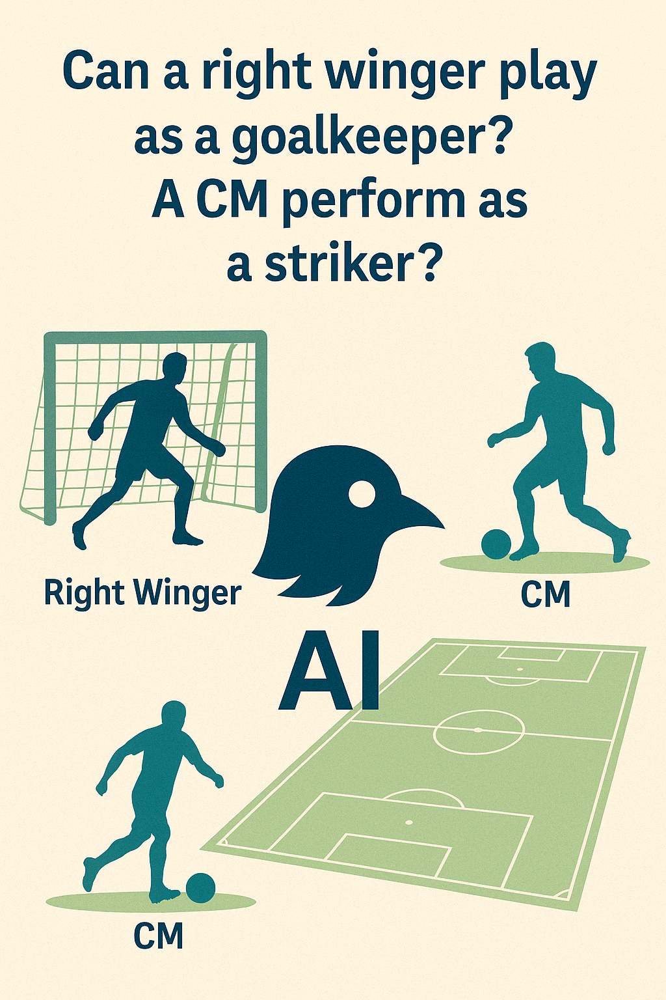
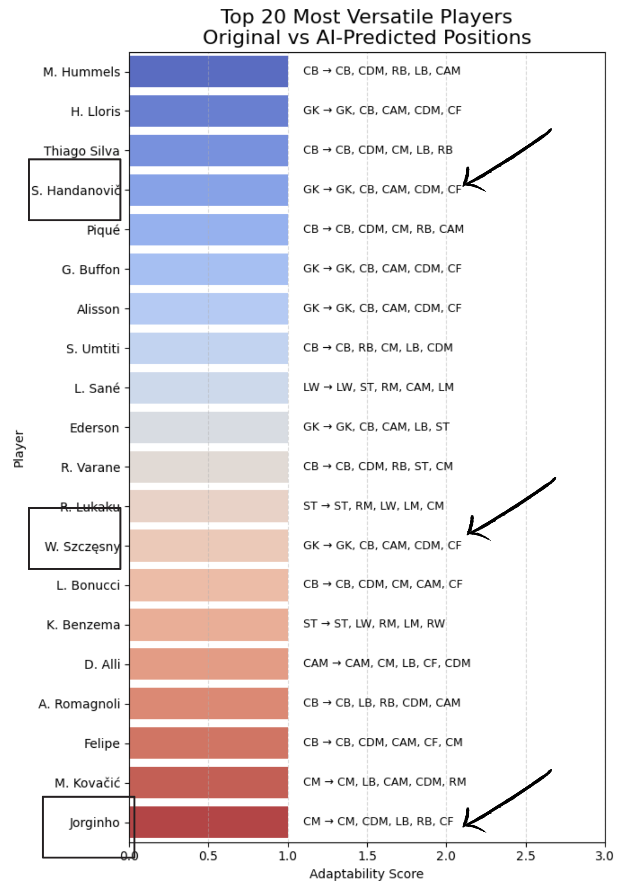

# VersaScout
# ⚽ VersaScout: AI-Based Player Versatility Assessment



This project uses machine learning to analyze and predict **positional flexibility** of FIFA players based on in-game attributes.

With over 17,000 players from SoFIFA, our AI model evaluates each player's ability to perform in roles beyond their assigned position — uncovering **hidden tactical assets** like F. Valverde or J. Kimmich who fit multiple positions effectively.

---

## 🔍 Key Features

- 🎯 **Original vs AI-Predicted Positions** for every player
- 📈 **Adaptability Score** — how many positions the player can fit into with high confidence
- 📊 **Interactive Visualization** of top 20 most versatile players
- 🧠 Supervised model trained using Random Forests on skill attributes only
- 🔍 Optional PCA + KMeans clustering for playstyle analysis

---

## 📷 Screenshots

### Top 20 Most Versatile Players (Matplotlib)


### Some interesting insights south of the previous results




## 🧠 Insights from VersaScout’s Positional Versatility Analysis

### 1. 🧤 Goalkeepers Show Surprising Tactical Overlap  
Several goalkeepers (e.g., **Hugo Lloris**, **Samir Handanović**, **Gianluigi Buffon**, **Alisson**, **Wojciech Szczęsny**) have relatively high adaptability scores, with AI predicting potential fits in:  
- Central defensive roles (**CB**)  
- Defensive midfield roles (**CDM**)  
- Occasionally attacking roles like **CAM** or **CF**

> 📌 **Insight:** While some of this may reflect statistical noise or generalized traits (e.g., strength, composure), it suggests the model detects **underlying similarities in skill profiles**, beyond rigid positional labels.

---

### 2. 🧱 Center-Backs (CBs) Appear Highly Adaptable  
Players like **Mats Hummels**, **Thiago Silva**, **Piqué**, and **Raphaël Varane** are predicted to fit roles beyond defense, including:  
- **CM**, **CAM** (central roles)  
- **LB/RB** (wide defense)  
- Occasionally even **CDM**

> 📌 **Insight:** The AI seems to recognize that elite defenders often possess **tactical awareness, passing, and physical presence** transferable to midfield roles.

---

### 3. 🌀 AI Challenges the Rigidity of Positional Labels  
The model frequently predicts fit in roles far from a player’s listed one:
- **Leroy Sané** (originally LW) is fit for **ST**, **RAM**, **CAM**
- **Dele Alli** (CAM) is predicted to fit **LB** and **CF**

> 📌 **Insight:** The model isn’t just matching to FIFA roles — it’s interpreting **skillsets**, suggesting possible **non-traditional role fits**.

---

### 4. 🧮 Adaptability Scores Are Relatively Low  
Most top players show **1–2 strong alternate fits**, with scores between **1.0 and 2.5**.

> 📌 **Insight:** While positional overlap exists, **true universal adaptability is rare**, reinforcing the reality that players specialize — but some can still stretch their tactical roles.

---

### 5. 🏆 Top Versatile Players Span All Roles  
The most adaptable players include:
- **Goalkeepers (GK)**
- **Center-Backs (CB)**
- **Midfielders (CM, CAM)**
- **Strikers (ST)**

> 📌 **Insight:** Versatility isn't owned by one role — it emerges from a **well-rounded attribute profile**, no matter where the player starts.


## 📁 Project Structure

```bash
.
├── README.md
├── AdaptiveXI.ipynb              
├── images/
│   ├── top20_versatile_players.png
│   └── insights.png
├── data/
│   └── fifa_players.csv
│          Dataset : https://www.kaggle.com/datasets/maso0dahmed/football-players-data        
├── outputs/
│   └── comparison_table.csv      
